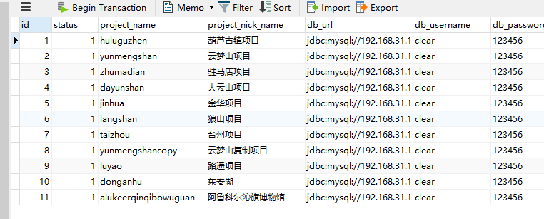

# 目录结构

```
|--packages
    |--miniapp # 小程序代码仓库
    |--map # 小程序内景区地图导览页面，因小程序原生地图不支持手绘地图的瓦片加载。
```

# 项目说明

[一机游小程序文档说明](packages/miniapp/README.md)

已知的项目名：

- yunmengshan 云梦山
  - #小程序://云端游云梦/ZkI3sRs5to5cEel
- huluguzhen 葫芦古镇
  - #小程序://葫芦古镇/oTBbYvRTycqMEMJ
- zhumadian 驻马店 （H5页面）
  - [ ] 后期维护需要重新检查下，项目结构发生了很大变化
- luyao 人生影视城



# 小程序开发

默认主题：

`npm run dev:mp-weixin`

项目定制：自己定义打包指令

`npm run dev:mp-weixin_luyao`

用开发者工具打开  `packages/miniapp/dist/dev/mp-weixin`

# 小程序发布说明

1. 发布前先打包。发布命令自己在package.json定义。方便在根目录执行打包指令。例如 `npm run build:luyao`
2. 用开发者工具打开 `packages/miniapp/dist/build/mp-weixin` 这个目录
3. 从开发者工具进行上传
4. 登录[小程序管理后台](https://tourismbackend.pcleartv.cn/frontend/cleartv_admin/#/miniapp/publish),  admin / 123456
5. 先在模板管理把新上传的模板，点击添加到模板库
6. 在小程序发布管理，点击上传代码。项目名就写具体的项目名，例如：luyao，选择刚才上传模板ID。确定之后就可以看到体验版二维码了，可以先让客户确认下效果。如果没问题，就提交腾讯审核

# 地图页面

因为架构目录发生改变。地图页跳转小程序页面时，页面地址也有修改。从该仓库打包的地图页面，服务器都放到map_new目录

需要调试导览页面，先启动地图项目

`npm run dev:map`

# 关于仓库标签

因为定制项目众多。为方便管理。发布后，git提交记录最好打上项目标签及版本号。例如 云梦山-v0.0.1
